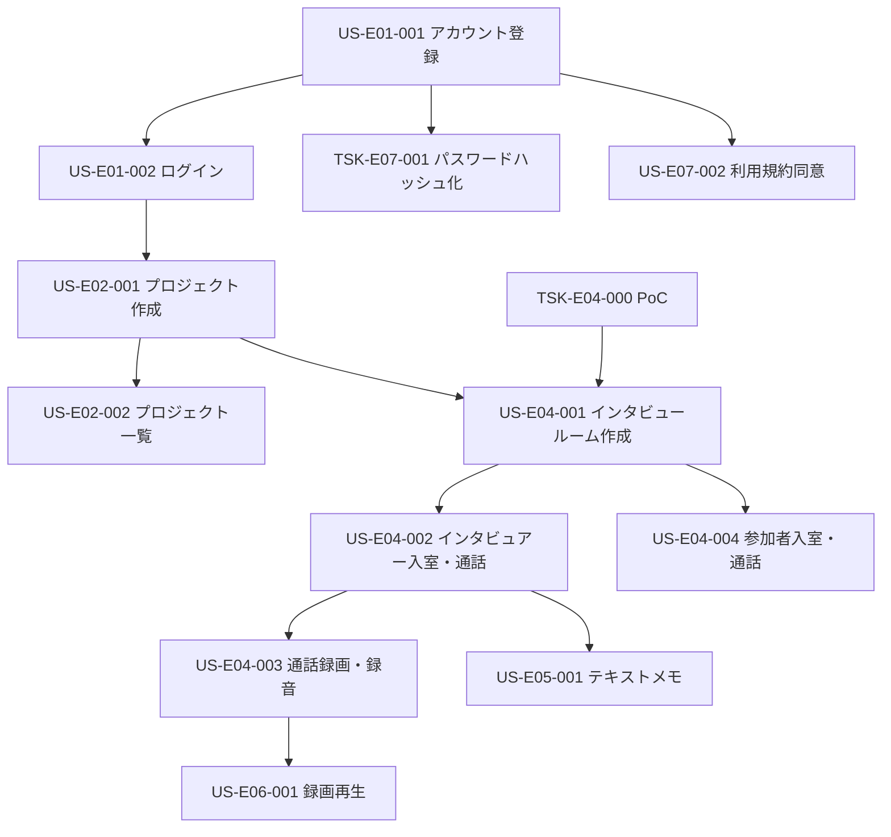

# 実装順序計画：オンラインで定性調査を行うプラットフォームサービスの構築

## 1. 概要

このドキュメントは、オンラインで定性調査を行うプラットフォームサービスの構築のユーザーストーリー実装順序を定義します。
優先度付け方針: **バランス型**

## 2. ストーリー分析

| ストーリーID  | 依存関係                                  | 難易度 (Estimate) | ビジネス価値 (Priority) |
|---------------|-------------------------------------------|-------------------|-------------------------|
| TSK-E04-000   |                                           | L                 | critical                |
| US-E01-001    |                                           | M                 | high                    |
| US-E01-002    | US-E01-001                                | S                 | high                    |
| TSK-E07-001   | US-E01-001                                | S                 | high                    |
| US-E07-002    | US-E01-001                                | S                 | high                    |
| US-E02-001    | US-E01-002                                | M                 | high                    |
| US-E02-002    | US-E02-001                                | S                 | high                    |
| US-E04-001    | US-E02-001, TSK-E04-000                   | M                 | high                    |
| US-E04-002    | US-E04-001                                | L                 | high                    |
| US-E04-003    | US-E04-002                                | M                 | high                    |
| US-E04-004    | US-E04-001                                | M                 | high                    |
| US-E06-001    | US-E04-003                                | M                 | high                    |
| US-E05-001    | US-E04-002                                | S                 | low                     |

## 3. 依存関係グラフ

## 4. 推奨実装順序

バランス型の方針に基づき、依存関係、ビジネス価値（Priority）、難易度（Estimate）を考慮して以下の順序で実装を進めることを推奨します。

**フェーズ 1: 基盤技術検証とコア認証**
1.  **TSK-E04-000**: WebRTCを利用したリアルタイムビデオ・音声通話機能の技術検証 (PoC) - `critical`, `L` (最重要技術検証)
2.  **US-E01-001**: 新規ユーザーとしてメールアドレスとパスワードでアカウント登録できる - `high`, `M` (基本機能)
3.  **TSK-E07-001**: ユーザーパスワードはハッシュ化してデータベースに保存する - `high`, `S` (セキュリティ基本)
4.  **US-E01-002**: 登録ユーザーとしてメールアドレスとパスワードでログインできる - `high`, `S` (基本機能、US-E01-001に依存)
5.  **US-E07-002**: ユーザーは利用規約とプライバシーポリシーに同意した上でサービスを利用開始できる - `high`, `S` (法的要件、US-E01-001に依存)

**フェーズ 2: プロジェクト管理とインタビュー準備**
6.  **US-E02-001**: ログインユーザーとして新しい調査プロジェクトを作成できる - `high`, `M` (コア機能、US-E01-002に依存)
7.  **US-E02-002**: 作成した調査プロジェクトの一覧をダッシュボードで確認できる - `high`, `S` (コア機能、US-E02-001に依存)
8.  **US-E04-001**: プロジェクトオーナーとしてオンラインインタンタビュールームを作成（予定）し、参加者用URLを発行できる - `high`, `M` (コア機能、US-E02-001, TSK-E04-000に依存)

**フェーズ 3: コアインタビュー機能**
9.  **US-E04-002**: インタビュアーとしてルームに入室し、1対1のビデオ・音声通話を開始できる - `high`, `L` (最重要機能、US-E04-001に依存)
10. **US-E04-004**: インタビュー参加者として発行されたURLからルームに入室し、ビデオ・音声通話に参加できる - `high`, `M` (最重要機能、US-E04-001に依存)
11. **US-E04-003**: インタビュアーとしてビデオ・音声通話を録画・録音できる - `high`, `M` (重要機能、US-E04-002に依存)

**フェーズ 4: インタビュー後処理と補助機能**
12. **US-E06-001**: インタビュアーとして録画されたインタビュー動画をプラットフォーム上で再生できる - `high`, `M` (重要機能、US-E04-003に依存)
13. **US-E05-001**: インタビュアーとしてインタビュー中に簡易的なテキストメモを記録できる - `low`, `S` (補助機能、US-E04-002に依存)

## 5. 実装スケジュール案

| フェーズ                                 | ストーリー                                                                                                                                                                                             | 予定期間   |
|------------------------------------------|----------------------------------------------------------------------------------------------------------------------------------------------------------------------------------------------------|------------|
| フェーズ 1: 基盤技術検証とコア認証       | TSK-E04-000, US-E01-001, TSK-E07-001, US-E01-002, US-E07-002                                                                                                                                       | 〜[日付1] |
| フェーズ 2: プロジェクト管理とインタビュー準備 | US-E02-001, US-E02-002, US-E04-001                                                                                                                                                               | 〜[日付2] |
| フェーズ 3: コアインタビュー機能         | US-E04-002, US-E04-004, US-E04-003                                                                                                                                                                 | 〜[日付3] |
| フェーズ 4: インタビュー後処理と補助機能   | US-E06-001, US-E05-001                                                                                                                                                                             | 〜[日付4] |

*具体的な日付はチームのベロシティやリソース状況に応じて調整してください。*

## 6. 次のステップ

1. 「ストーリー実装」コマンドで各ストーリーの実装を開始（上記推奨順序に従う）
2. 実装中に発見された新たな依存関係を記録し、必要に応じてこのドキュメントを更新
3. 定期的に進捗を確認し、必要に応じて実装順序を調整
